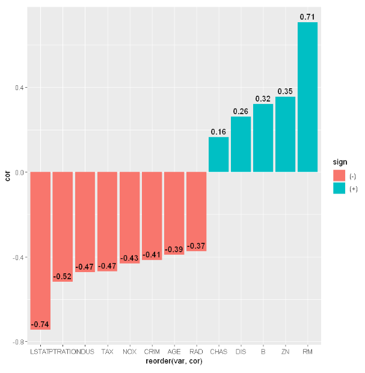
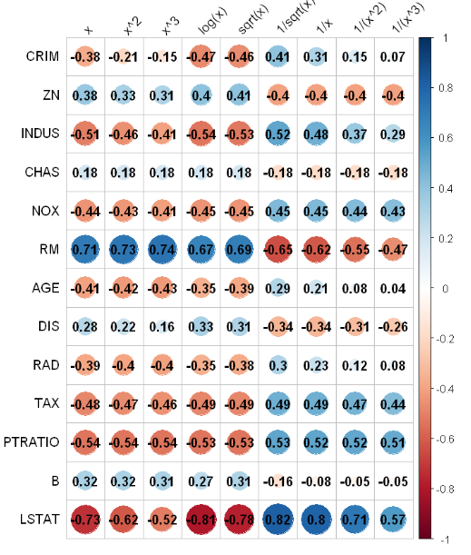
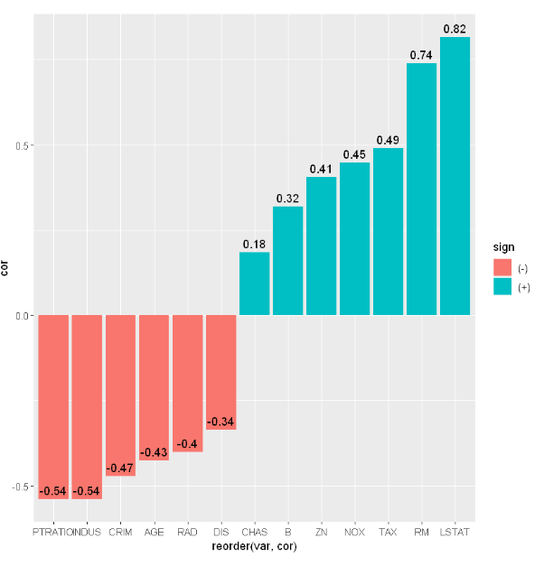

## 요약

### 파일 설명
- GetData.py : 주어진 url로부터 데이터를 불러와 train/test 데이터로 분리후 csv 파일로 저장
- visualization_R.ipynb_
  - R 스크립트 코드
  - 시각화 및 최적 변수 찾기
- Linear Regression.ipynb
  - R 스크립트 코드
  - 선형회구모델 구현
- RandomForest_Regression.ipynb_
  - Python 스크립트 코드
  - 랜덤포레스트 회구모델 구현
- Ensemble.ipynb
  - Python 스크립트 코드
  - 두 모델에 대한 앙상블
### 변수 선택  
  - 독립변수와 종속변수간의 상관관계를 확인
  - 독립변수를 변수 변환 진행
    - 각각 'x' ,'x^2', 'x^3', 'log(x)', 'sqrt(x)', '1/sqrt(x)', '1/x', '1/(x^2)', '1/(x^3)' 형태로 변환
    - 비선형관계를 파악하고 이를 선형관계로 변경하기 위함   
  - 상관관계가 0.4 이상인 변수만을 선택하여 모델링에 
  ### 독립변수와 종속변수간의 상관관계 확인
  
  ### transformation된 독립변수와 종속변수와의 상관관계
      
  ### 변경된 독립변수와 종속변수간의 상관관계 확인
  
  
  ### 모델에 사용되는 데이터
  - train/validation/test : 6.4:1.6:2 의 비율로 사용
  - train/validation 데이터를 이용하여 모델링
  - test데이터를 최종적으로 예측
  
  ### 회귀모델
  - 선택된 변수를 이용하여 회귀모델
  - 추가 변수선택은 stepwise 방법 적용
  - 'both' 파라메터를 이용하여 변수를 추가/제거 후 모델적합도가 좋아지는지에 대한 유의미성을 확인하면서 변수선택
  - 최종 선택된 변수는 CRIM, RM, AGE, PTRATIO, LSTAT
  - 테스트 데이터에 대한 MSE 값은 4.89
  ### 랜덤포레스트 회귀
  - 선택된 변수를 이용하여 랜덤포레스트 회귀모델
  - 테스트 데이터에 대한 MSE 값은 4.55
  
  ### 앙상블
  - 각 모델에 대한 적합도를 계산하고 더 높은 적합도를 보인 모델에 더 많은 가중치를 부여
  - 적합도는 검증데이터에 대한 예측값과 실제값의 오차를 구하고 이 오차에 대한 분산값을 이용함
  - 분산이 작을수록 더 적합한 모델
  - 분산값을 역수를 취한후 각 모델에 가중합으로 계산함 
  - 테스트 데이터에 대한 MSE 값은 4.47로 두 모델보다 앙상블 보델이 더 높은 정확도를 보여줌
  
   
  
  
  
